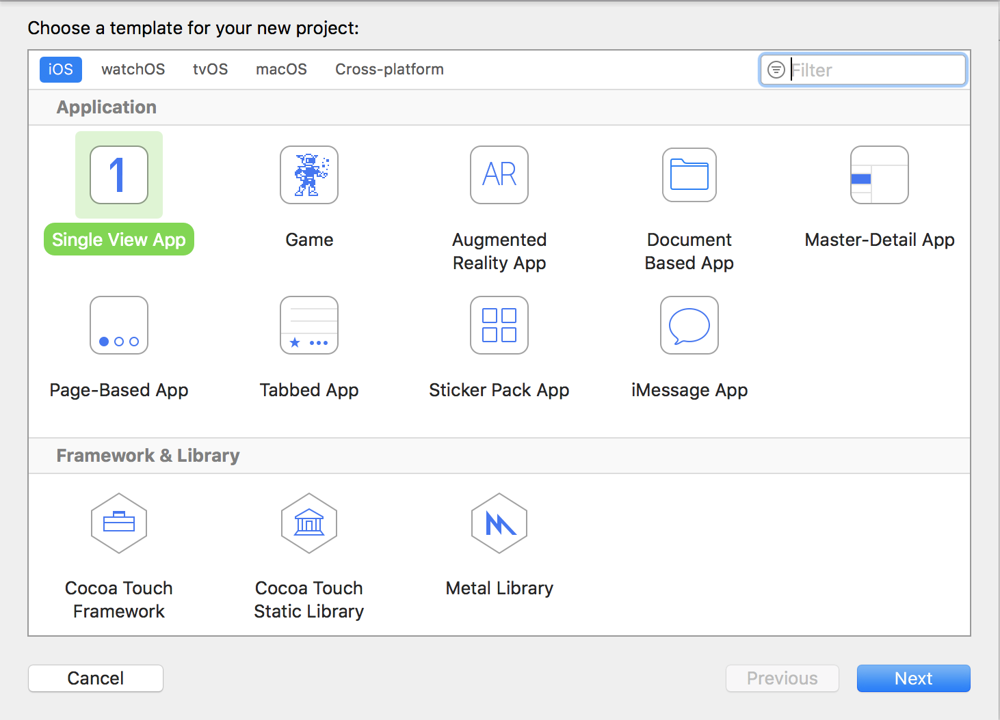
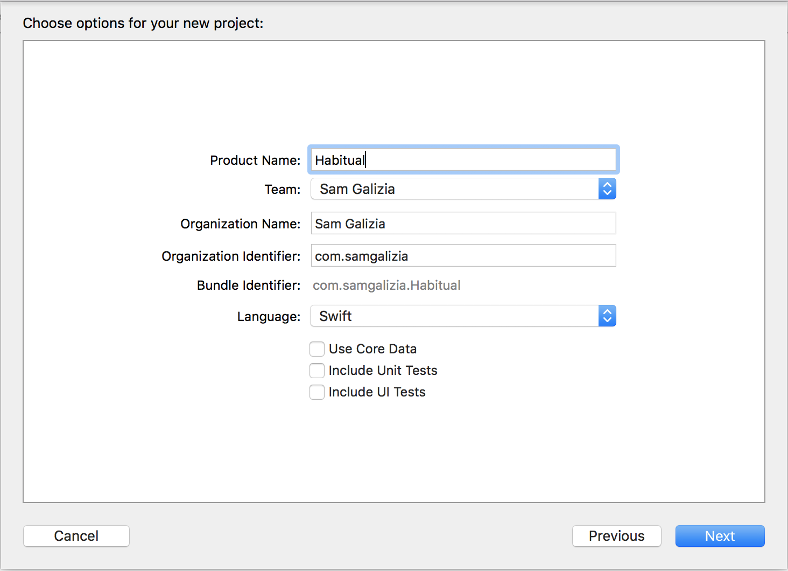
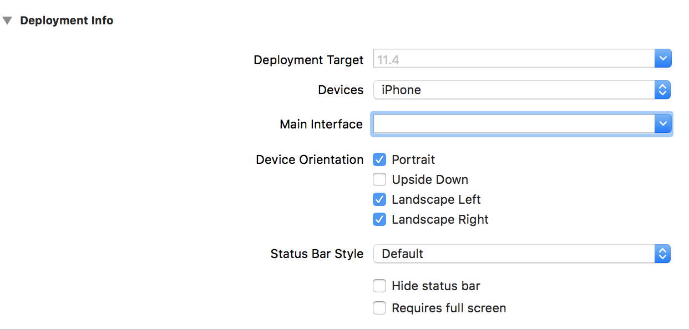

In this tutorial, you are going to make an iOS app that will help users track their daily
habits. You will not be using any third party libraries to create this project, everything
will be built in and provided by Apple already. One of the biggest differences you will see
with this app is the way that the views are structured.

In many tutorials, you will be shown how to make all of your views inside of a storyboard file.
You will not be using a storyboard in this project. Before you get freaked out by that, let me
assure you that you will still be building your views like you did in a storyboard, you are just
going to build the views in individual files rather than in one massive storyboard file. Learning
how to structure apps this way will make you a better developer as not everyone uses storyboards.

# First Steps

The first step is to create a new Xcode Project.

> [action]
> Open Xcode and create a new **Single View App** project.
> 
> Name your project `Habitual` and make sure that the *Language* is set to `Swift`.
> You will not be using *Core Data*, *Unit Tests*, or *UI Tests* so make sure all of those options
> are unchecked.
> 

# Removing Storyboards

Now that you have a new project set up, you need to make a few tweaks to your settings since you
will not be using storyboards. Apple has a lot of great defaults set up when you create a new project.
Without them setting many of these defaults, it would be very complicated to set up a new project.
It is okay to deviate from these settings though, and that is exactly what you are going to do now.

> [action]
> In the *File Navigator* on the left hand side, right click on *Main.storyboard* and delete it, moving
> it to the trash. Next, click on the project file at the top of the *File Navigator*. Uunder,
> *Deployment Information* find the field called *Main Interface* and clear out the name the value there.
> 

With those first two steps out of the way, you're well on your way to getting this app up and running
with no storyboards! Before anything will actually show up, you need to change the main view that will
be loaded when your app launches. You will setup this change in the *AppDelegate.swift* file.

> [action]
> Open *AppDelegate.swift* and locate the *application(_: didFinishLaunchingWithOptions)* function. Replace
> the code inside that function with the following:
>
```
// Create and set the window to be the same size as the screen
window = UIWindow(frame: UIScreen.main.bounds)
>
// Create an instance of the main view controller
let mainController = UIViewController()
mainController.view.backgroundColor = .green
>
// Tell the window to load the main controller as it's root view
window!.rootViewController = mainController
window!.makeKeyAndVisible()
>
return true
```
>

The comments in the above code should make it pretty clear what is going on, but lets go over it!

The first thing you need to do is create an instance of the `UIWindow` object and make it the size of the
`main` screen's bounds. The next step is to create an instance of the main view controller, or the first
controller, that you want to load. In this case, you are just creating a temporary controller to see if
you have hooked up the settings correctly. You set the background to green so that it is different from
the launch screen. The last step is to set the `rootViewController` of the *window* to the controller that
you intialized, and then set the *window* to be visible using `makeKeyAndVisible()`.

Go ahead and run your project now and make sure that when it loads up you see the greeb screen. If you are
seeing nothing but a black screen, make sure that you check your code and the settings one more time to make
sure that they match. If you are seeing the green screen you are ready to move on to the next section!

# Summary

In this section, you learned how to create a new Xcode Project and remove the storyboard file! You also learned
how to set up the settings in your project to use view controllers that you created. Throughout the rest of
the tutorial, you will be creating view controllers programmatically and loading the associated view files.
You will need to get comfortable with this as you move forward. Head on over to the next section to learn how
to set up your first view and load it up!
