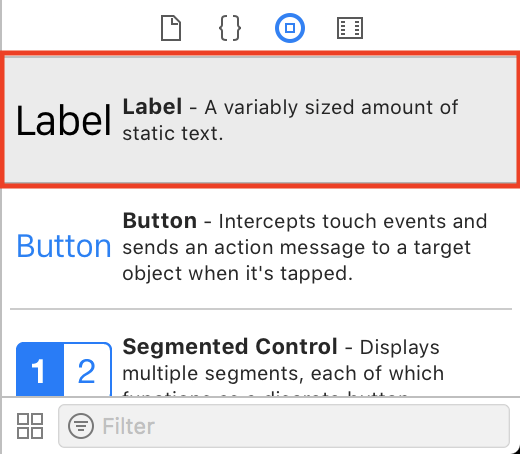
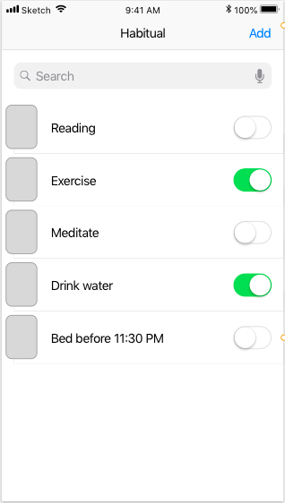
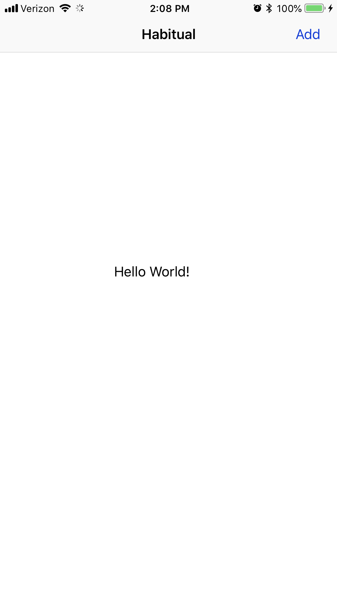
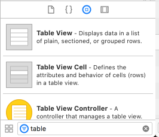
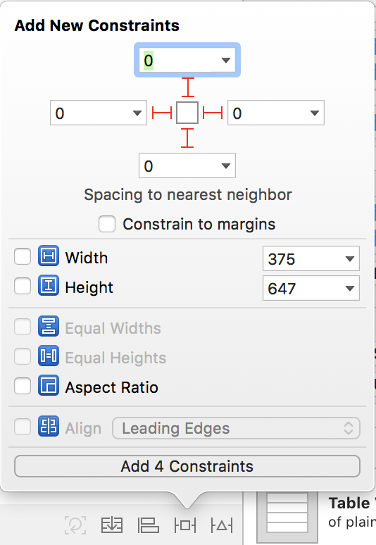
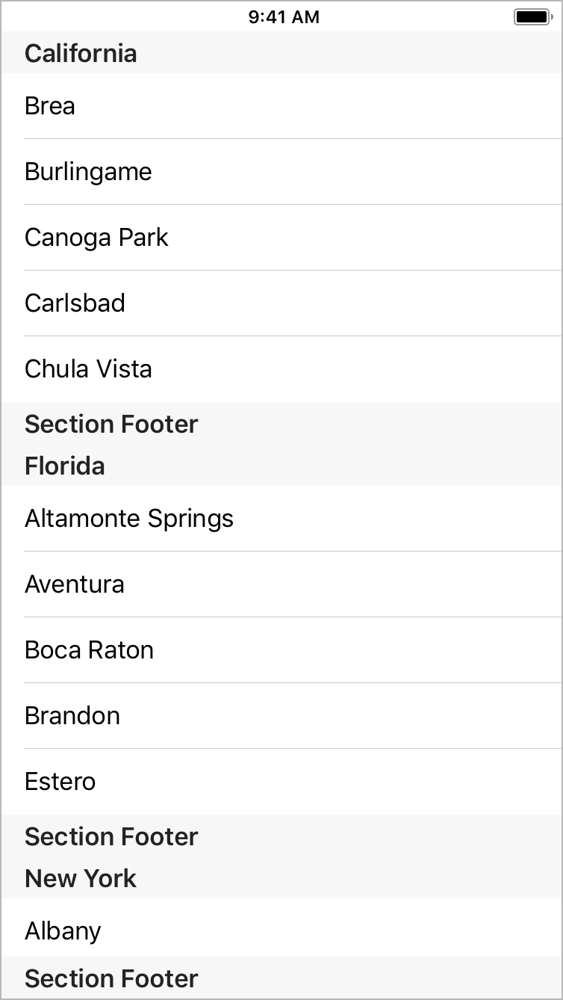
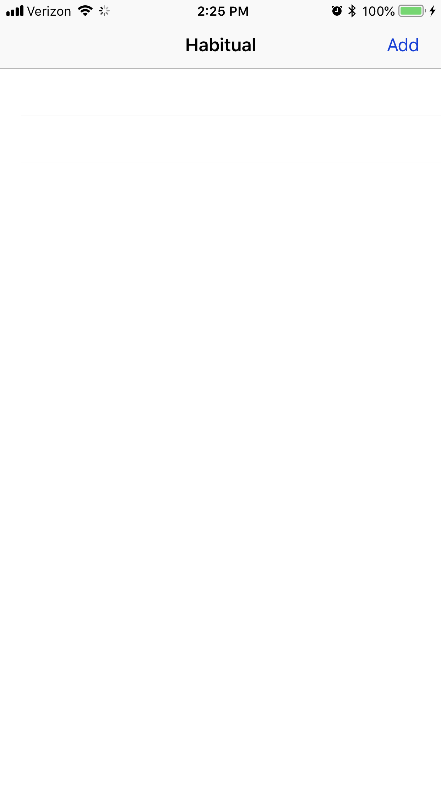

In this section you are going to set up the main view in the application. Habitual is going to
be an app that helps users track when they do or don't complete daily habits. In the main view,
you want to have a table that will display habits that the user wants to track. You will also
need a way to add new habits. Eventually, you will add a search function as well, but for now
let's go ahead and set up the first view for it's basic functionality.

# Creating and Connecting the View

Since you removed the *Storyboard* file from your project, I am sure you are wondering how you
will create this new view. There are different ways that you can do this, but you are going to
use a shortcut that creates both files at the same time for you.

> [action]
> Press `CMD+N` to create a new file. Select *Cocoa Touch Class* as the file type.
> 
> On the next screen, update the name of the file so that it reads `MainViewController`.
> Make sure that you also check the box for *Also create XIB File* and that the language is
> set to *Swift*.
> 
> You will notice that the class you are subclassing is `UIViewController`. This default value is
> perfect becaue that is what you want to subclass. Xib files are Xcode Interface Builder files.
> If you have used a storyboard, you have used the Interface Builder before, only you were using a
> storyboard, which is a collection on of Interfaces all together in one file. You will see this 
> dialogue again throughout the tutorial as you create more views. The last step here is going to be
> selecting both of the files you just created, right click on them and select *Create Subgroup from Selection*.
> This will create a folder to contain your view files. It is always a good idea to stay organized from
> the start! Your project directory on the left hand side should now look like this:
> 

This is a great a start! Go ahead and open up the two files you created and look around. You should
see that the `MainViewController.swift` file has some default code in it, but it pretty much looks
just like what you would have done if you had created the file yourself.

If you take a look at the `MainViewController.xib` file you will see that it is exactly like editing
a storyboard, you just have one view that you are working with instead of all the views in your app.
There are still a few steps to do before we can load this view up in the app though.

# Cleaning Up the Junk

You have created the files for your new view controller, but you still need to get rid of the old
view controller file that was created by default when you created your app.

> [action]
> Right click on the `ViewController.swift` file and delete it, moving it to the trash.
 
Awesome, now all the relics of the past are gone and you are free to move forward with your new
way of adding views. There is one final step to be able to use our views properly though. You
are going to create an extension of `UIViewController` that will help you to load your views
effortlessly throughout the rest of your code.

> [action]
> Create a new file, make sure you choose  *Swift* as the file type. Name the file
> `UIViewControllerExtensions.swift` and replace the contents of the file with the following:
>
```
import UIKit
>
extension UIViewController {
  static func instantiate() -> UIViewController {
    return self.init(nibName: String(describing: self), bundle: nil)
  }
}
```
>

I know that is some funky looking code, but don't worry, it's actually very straightforward! The
first thing you are doing is declaring you are making an *extension* on the class *UIViewController*.
An extension is simply a way to add more functionality to a class that already exists. In this
case, you don't have access to change the base code, so you use an *extension* to extend the 
capabilities of the class.

Inside of the *extension* you are creating a *Static* class method. *Static* class methods function
the same as methods declared with the *class* keyword. The main difference here is that *Static* 
methods can not be overrode by a subclass. Both types of methods here are associated with the class
and not an *instance* of the class. 

The method created here is called `instantiate()` because you are using it to create an instance of
this class. That is also why the return type is `UIViewController`, you are creating a new instance
of your class, and since it subclasses `UIViewController`, it can be returned by this method. Inside
the method, you are simply returning an instance of the class calling the method, and loading a *nib*
file (.xib) that has the same name as the class calling the method.

That last part may seem a little confusing, so I want to clarify. The reason that you created the files
for the main view using the *Cocoa Touch Class* way, is because it names both files the same exact thing.
It also makes the class declared inside the file have the same name. Because they all have the same name, 
you can use `String(describing: self)` to get the name of the class calling the method as a `string`, and
supply it to the `nibName` parameter.

If this blew your mind a little bit, join the club :) I was floored the first time I saw this!

# Linking Up Your New Class

Okay, now that you have the cleanup out of the way, lets take a look at how you can use that crazy new
`instantiate()` method that you created.

> [action]
> Open *AppDelegate.swift* and locate the lines of code where you previously created the temporary
> view controller. You are going to replace that code with some new code that instantiates your
> main view. You will also add a `UINavigationController` so that you can take advantage
> of the *Navigation Bar* throughout your app. Replace the code you have with the following:
>
```
// Create an instance of the main view controller
let navigationController = UINavigationController()
let mainViewController = MainViewController.instantiate()
navigationController.setViewControllers([mainViewController], animated: false)
>
// Tell the window to load the main controller as it's root view
window!.rootViewController = navigationController
window!.makeKeyAndVisible()
>
return true
```
>

In the above code, you create an instance of *UINavigationController*. You then use your new `instantiate()`
method to create an instance of the *MainViewController*. In the process you are loading the associated view
file, *MainViewController.xib*. Once you have a reference to your instance of *MainViewController* you set
the views for the *UINavigationController*. 

Behind the scenes, the navigation controller has an array that holds a reference to all of the views it is 
currently tracking. By using the `setViewControllers` method you set that array to have a single value, your
*MainViewController*. This effectively sets the 'root' of the navigation controller.

Once the navigation controller is all set up, you set it to be the `rootViewController` for the window. Setting
the `navigationController` as the root will make it the first view displayed in the app. Since you just set it up
to display your *MainViewController* as the root, it should display your view. Let's do one more thing before
testing to see if everything is wired up correctly.

> [action]
> Open *MainViewController.xib*. In the bottom left corner of Xcode, locate the *Object Library* and drag in
> a **Label**.
> 
> Place the *Label* in the middle of the view like so:
> 
> Now change the text of the label so that it reads `Hello World!`.
> 

Great, now run your project and let's see if everything loaded up correctly!

If you see the label you created in the center of a white screen, you have linked everything up correctly!
Congratulations, you are ready to move forward. If you are having any troubles, please look back on the
previous steps and check that your code matches!

# Getting Down to Business

I know that was a lot of setup to check if everything was working. It was important to make sure you had
wired everything up correctly before moving on. It would be much harder later on, once there is a bunch
of code, to try and figure out why it might not be working.

Let's get down to business and set up the view with the real items you need for project. Below is an image
of what your main view will look like when it is finished:


## Navigation Bar

Let's start by getting the navigation bar set up. In the previous section, you created the navigation bar
in code. Beacuse it was created in code, you will need to make changes to it in your individual code files.
This may sound hard or like a waste of time, especially when you can do everything in a storyboard file.
I encourage you to power through, learning another way to accomplish tasks will definitely help you at some
point down the line!

> [action]
> First things first, open *MainViewController.swift* and replace the code in the file with the code below:
>
```
import UIKit
>
class MainViewController: UIViewController {
>
  override func viewDidLoad() {
    setupNavBar()
  }
>
}
>
// MARK: - Navigation Bar Code
extension MainViewController {
  // Setup function to setup the NavBar
  func setupNavBar() {
    // Sets the title for this view controller in the navbar
    title = "Habitual"
>
    // Create a bar button item for the 'Add' button
    let addButton = UIBarButtonItem(title: "Add", style: .plain, target: self, action: #selector(addHabit(sender:)))
>
    // Set the bar button as the right button
    navigationItem.rightBarButtonItem = addButton
  }
>
  // This method will be called when the 'Add' button is pressed
  @objc func addHabit(sender: UIBarButtonItem) {
    // Test button is wired up
    print("Add button tapped")
  }
}
```
>

The above code is used to set up the navigation bar in this view. When looking at this code, you will
notice that it is in an extension of your class, *MainViewController* When writing code, organization is
so important. If you do not keep your code organized, you will make it harder on yourself when trying to 
add new features or track down bugs.

In the extension you create a function called `setupNavBar()`, it does exactly what the name describes.
Inside this function you start by setting the *title* property of the view controller. This is used to display
the title in the navbar, in your case `Habitual`. Once you have set the title, you create a button that will
be used as the *Add* button.

In the creation of this button, you set the *title* to `Add`, which is what you want displayed. You set the 
*style* to `plain` so that it is displayed like a regular button. The *target* is set to `self`, because this
view controller will handle the *action*. The *action* is a reference to a function that will be called when
the button is tapped. In this case, you have set up a function called `addHabit(sender:)`, which will eventually
trigger a segue to the *AddHabitViewController*. That view does not exist for now, so you just print a message
to the console when it is tapped.

> [info]
> You may not have seen the `@objc` syntax before. It is being used in this context to expose this method to the
> Objective-C runtime. Don't get too caught up in the details here, but for the `#selector` method to work, your
> function needs to be exposed to the Objective-C runtime. If you want to know more about this, check the
> documentation on it [here](https://developer.apple.com/documentation/objectivec/objective_c_runtime).

Go ahead and run your project and make sure that when you app loads up that it looks like this:


If you are seeing your screen look the same, go ahead and press the *Add* button one or two times and check that 
`Add button tapped` appears in your console. If you are seeing the message show up in your console, you have wired
up the button correctly and are ready to move on!

## Table View

Now that the navigation bar is set up, let's set up the table view.

> [action]
> Open *MainViewController.xib* and remove the label that you previously added. In the bottom left, use the *filter*
> search bar to find the *Table View* by typing in `table`.
> 
> Now, drag the *Table View* into your view. Don't worry about the placement for now, you are about to use
> *Auto Layout* to pin the *Table View* where you want it. Locate the button in the bottom right of the view that
> kind of looks like a little Tie Fighter from Star Wars. Click on it and then make sure your settings match the
> settings in the image below. Pay close attention to the numbers in the boxes in the top section. These numbers
> are constant values that you want to represent the spacing between this view and it's nearest neighbor. Also, 
> note that the little `I` shaped beams are all solid, this means that you have activated them. The button on the
> bottom should say, 'Add 4 Constraints', like in the picture. When your settings are good, click the button to add
> the constraints to the view.
> 
> Using this popup, you are setting *constraints* on the *Table View*. You are telling *Auto Layout*
> to make sure that your *Table View* takes up the whole screen by pinning all sides to `0`. Since you do want your
> *Table View* to take up the whole screen, this is perfect.

Your view in the editor should now look like this:


Go ahead and run your project and check that your app now looks like the below image when it loads:


# Summary

You learned a lot of new skills in this section! You learned how to:

- Create a subclass of UIViewController and a matching xib file
- Load xib files with classes
- Create a class extension for an existing UIKit class
- Organize code using class extensions
- Create a UIBarButtonItem in code and wire it up with an action
- Add new views to a view controller
- Add some basic constraints to a view