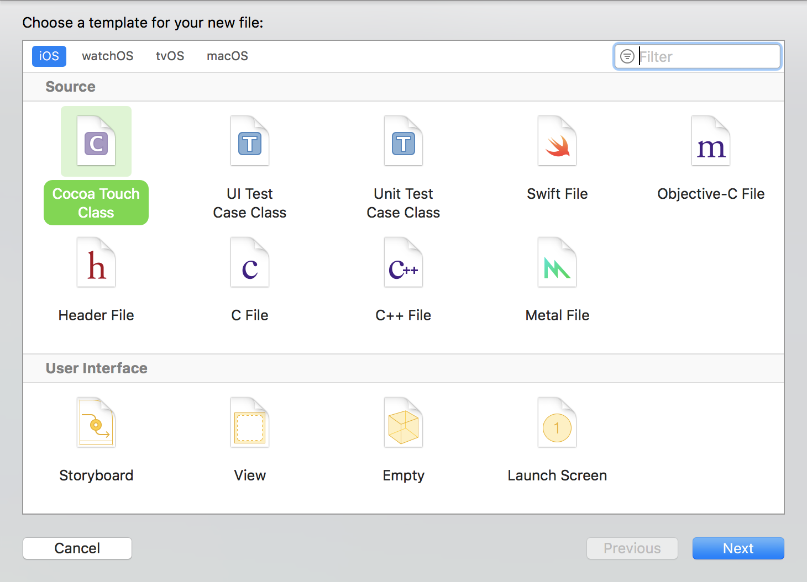
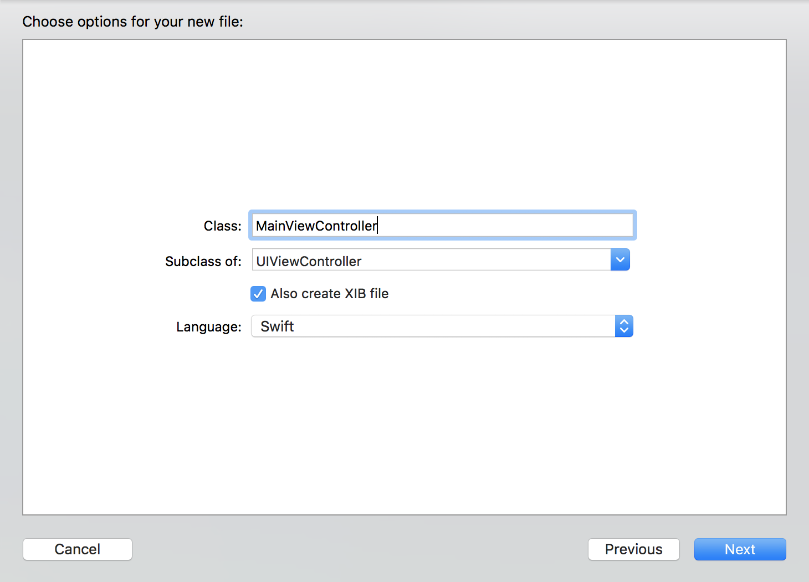
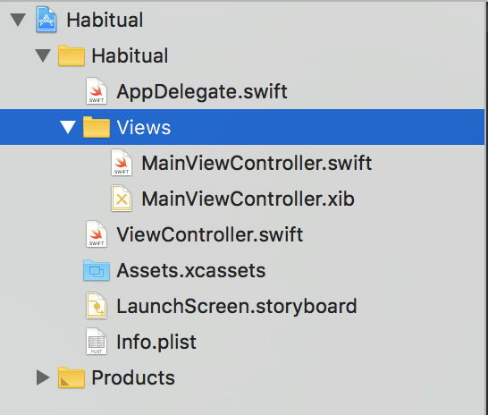
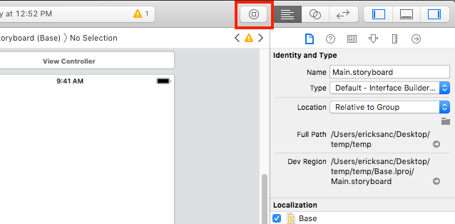
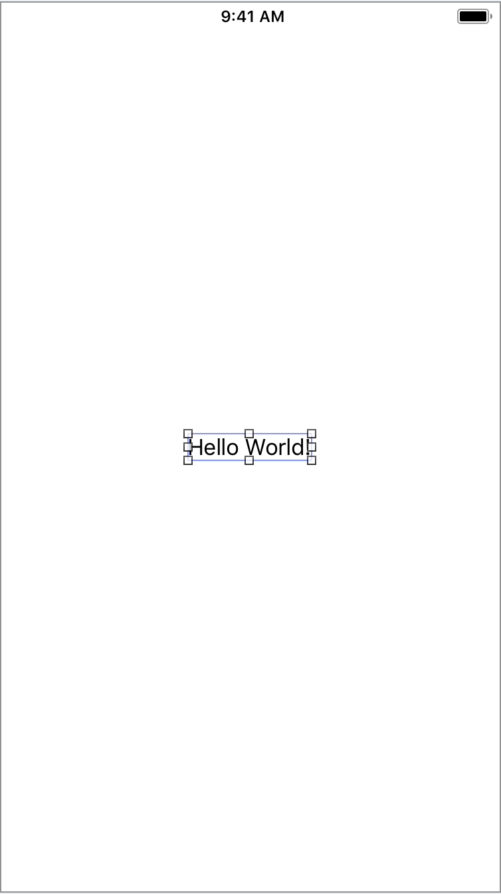
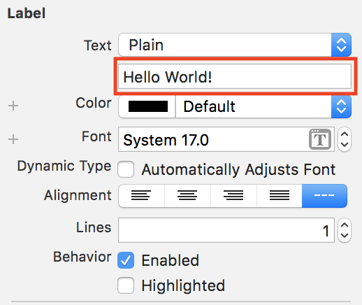

In this section you are going to set up the main view in the application. Habitual is going to
be an app that helps users track when they do or don't complete daily habits. In the main view,
you want to have a table that will display habits that the user wants to track. You will also
need a way to add new habits. For now,
let's go ahead and set up the first view for it's basic functionality.

# Creating and Connecting the View

Since you removed the *Storyboard* file from your project, I am sure you are wondering how you
will create this new view. There are different ways that you can do this. In this tutorial you'll use xib files.

> [action]
> Press `CMD+N` to create a new file. Select *Cocoa Touch Class* as the file type.
> 
> On the next screen, update the name of the file so that it reads `MainViewController`.
> Make sure that you also check the box for *Also create XIB File* and that the language is
> set to *Swift*.
> 
> You will notice that the class you are subclassing is `UIViewController`. This default value is
> adequate because that is what you want to subclass from. Xib files are Xcode Interface Builder files.
> If you have used a storyboard, you have used the Interface Builder before, only you were using a
> storyboard, which is a collection of Interfaces all together in one file. You will see this
> dialogue again throughout the tutorial as you create more views. The last step here is going to be
> selecting both of the files you just created, right click on them and select *Create Subgroup from Selection*.
> This will create a folder to contain your view files. It is always a good idea to stay organized from
> the start! Your project directory on the left hand side should now look like this:
> 

This is a great a start! Go ahead and open up the two files you created and look around. You should
see that the `MainViewController.swift` file has some default code in it, but it pretty much looks
just like what you would have done if you had created the file yourself.

If you take a look at the `MainViewController.xib` file you will see that it is exactly like editing
a storyboard, you just have one view that you are working with instead of all the views in your app.
There are still a few steps to do before we can load this view up in the app though.

# Cleaning Up the Junk

You have created the files for your new view controller, but you still need to get rid of the old
view controller file that was created by default when you created your app.

> [action]
> Right click on the `ViewController.swift` file and delete it, moving it to the trash.

Awesome, now all the relics of the past are gone and you are free to move forward with your new
way of adding views. There is one final step to be able to use our views properly though. You
are going to create an extension of `UIViewController` that will help you to load your views
effortlessly throughout the rest of your code.

> [action]
> Create a new file, make sure you choose  *Swift* as the file type. Name the file
> `UIViewControllerExtensions.swift` and replace the contents of the file with the following:
>
```swift
import UIKit
>
extension UIViewController {
  static func instantiate() -> Self {
    return self.init(nibName: String(describing: self), bundle: nil)
  }
}
```
>

I know that is some funky looking code, but don't worry, it's actually very straightforward! The
first thing you are doing is declaring you are making an *extension* on the class *UIViewController*.
An extension is simply a way to add more functionality to a class that already exists. In this
case, you don't have access to change the base code, so you use an *extension* to extend the
capabilities of the class.

Inside of the *extension* you are creating a *Static* class method. *Static* class methods function
the same as methods declared with the *class* keyword. The main difference here is that *Static*
methods can not be overrode by a subclass. Both types of methods here are associated with the class
and not an *instance* of the class.

The method created here is called `instantiate()` because you are using it to create an instance of
this class. That is also why the return type is `Self`, you are creating a new instance
of your class and since it subclasses `UIViewController`, it can be returned by this method. Inside
the method, you are returning an instance of the class calling the init method and loading a *nib*
file (.xib) that has the same name as the class calling the method.

That last part may seem a little confusing, so let's clarify. The reason that you created the files
for the main view using the *Cocoa Touch Class* way, is because it names both files the same exact thing.
It also makes the class declared inside the file have the same name. Because they all have the same name,
you can use `String(describing: self)` to get the name of the class calling the method as a `string`, and
supply it to the `nibName` parameter.

If this blew your mind a little bit, join the club :) I was floored the first time I saw this!

# Linking Up Your New Class

Okay, now that you have the cleanup out of the way, lets take a look at how you can use that crazy new
`instantiate()` method that you created.

> [action]
> Open *SceneDelegate.swift* and locate the lines of code where you previously created the temporary
> view controller. You are going to replace that code with some new code that instantiates your
> main view. You will also add a `UINavigationController` so that you can take advantage
> of the *Navigation Bar* throughout your app. Replace the code you have with the following:
>
```
guard let windowScene = (scene as? UIWindowScene) else { return }
window = UIWindow(frame: UIScreen.main.bounds)
>     
// Create an instance of the main view controller and a navigation controller
let mainViewController = MainViewController.instantiate()
let navigationController = UINavigationController(rootViewController: mainViewController)
>     
// Tell the window to load the navigation controller as it's root view
window?.rootViewController = navigationController
window?.makeKeyAndVisible()
window?.windowScene = windowScene
```
>

In the above code, you use your new `instantiate()` method to create an instance of the *MainViewController*. In the process you are loading the associated view
file, *MainViewController.xib*. Once you have a reference to your instance of *MainViewController* you set
it as the root view controller when instantiating the *UINavigationController*.

Once the navigation controller is all set up, you set it to be the `rootViewController` for the window. Setting
the `navigationController` as the root will make it the first view displayed in the app. Since you just set it up
to display your *MainViewController* as the root, it should display your view. Let's do one more thing before
testing to see if everything is wired up correctly.

> [action]
> Open *MainViewController.xib*. In the top right corner of Xcode, locate the *Object Library* and drag in
> a **Label**.
> 
> Place the *Label* in the middle of the view like so:
> 
> Now change the text of the label so that it reads `Hello World!`.
> 

Great, now run your project and let's see if everything loaded up correctly!

If you see the label you created in the center of a white screen, you have linked everything up correctly!
Congratulations, you are ready to move forward. If you are having any troubles, please look back on the
previous steps and check that your code matches!

# Getting Down to Business

I know that was a lot of setup to check if everything was working. It was important to make sure you had
wired everything up correctly before moving on.
