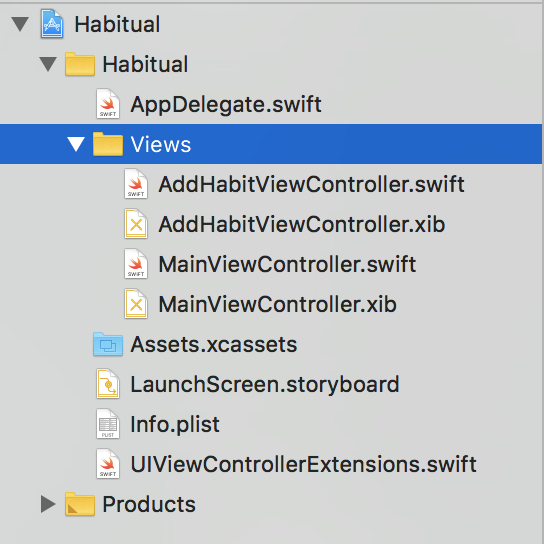
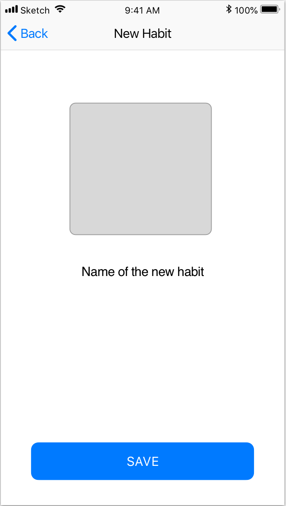
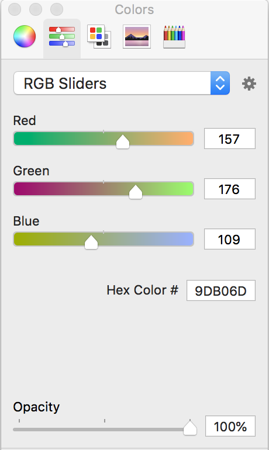
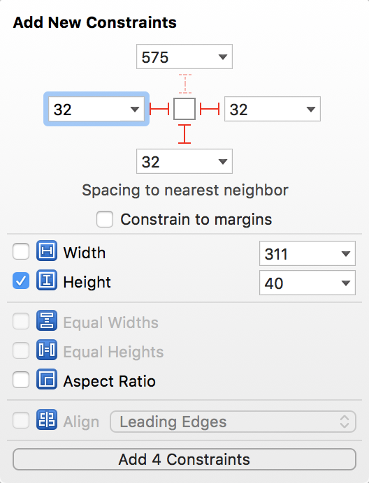
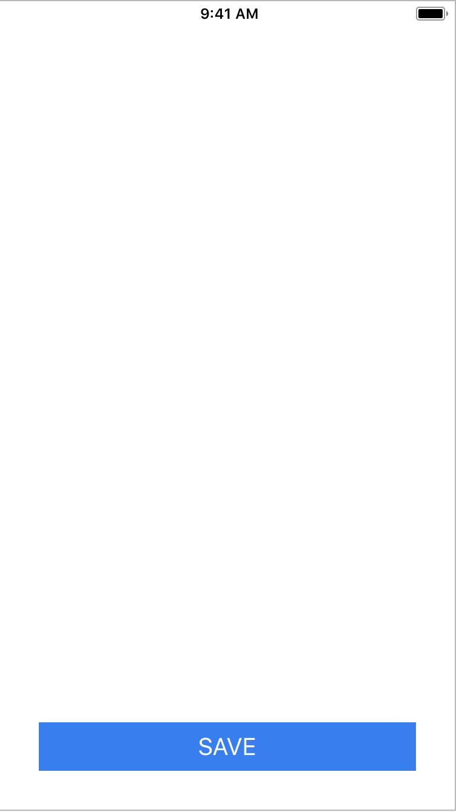

In this section you are going to learn how to add a new habit to your app. To add a new habit
you need to learn how to move between views in your app using your *NavigationController*. You
will learn how to create a new *UITableViewCell* that you can customize and load into the 
*Table View* that you created in the last section. To add new habits, you will also learn how
to use the new `Codable` protocol introduced in Swift 4. You will use this new protocol to 
create a data model that will be used to represent what a habit is and store it in the *UserDefaults*.

If you don't know what all of that means, don't worry, you will by the end of this section!

# New Habit View

The first thing you are going to do is create the new view that you will use to add a new habit.

> [challenge]
> Think back to how you created *MainViewController.swift* and *MainViewController.xib*. Your challenge
> is to create two new files called *AddHabitViewController.swift* and *AddHabitViewController.xib*. You
> should use the same method to create these files. Make sure you add them to the *Views* group. Go ahead
> and try that now.

<!-- -->

> [solution]
> If you think back to the *Main View* section, you created the files for the *Main View* by creating
> a new file and using the *Cocoa Touch Class* as the file type. After, you select that, make sure that
> you name the file correctly. Also, check to make sure that you are subclassing *UIViewController* and
> that you check *Also create xib file*. Once you have created the files, make sure to add them to the
> *Views* group in your file tree.

Great! Once that is all done, your file tree should look like the image below:

> [info]
> You may notice that in the screenshot above, the files inside the *Views* group are in alphabetical order.
> This is just another way of making sure your files are organized in a way that makes them easy to find.
> It is not required that you do this, but you may find it helpful. A quick way to achieve this is to select
> the *Views* group, then right click on it and select *Sort by Name*. The important takeaway is that your
> files are organized in a way that makes it easy for you to find them when you need to.

With those new files created, let's take a moment to set them up before trying to connect the views.

## NewHabitViewController

Before you start putting this view together, lets take a look at what it will roughly look like when it is
done.

Let's start by putting together the view in the *.xib* file. Remember, since the view is being loaded inside
of the *UINavigationController*, you don't need to physically add that to the view. Whatever you put inside
the view will automatically be loaded with the *Navigation Bar*. Look at the picture and imagine designing
everything below the *Navigation Bar*, that is exactly what you will do.

Let's start by adding in the components you will need. It looks like there is an *ImageView*, a *Button*,
and a *Text Field* to add the title of the habit.

> [action]
> Make sure you have *AddHabitViewController.xib* open. In the *Object Library* find the *Button* object
> and drag it on to the view. Don't worry about the position for the moment. Take a look at the 
> *Attributes Inspector* (make sure the button is selected). Scroll down until you see the section named
> **View**, change the *Background Color* by cicking on the box with a line through it. A color picker
> will appear.
> 
> Set the color to a blue color that you like, or feel free to use `Red: 40, Green: 124, Blue: 246`.
> Now scroll up until you find the property called *Text Color* under the **Button** heading. Set the
> *Text Color* to `White`. Change the *Title* of the button to read `SAVE`.

The button is almost ready, but before you adjust the text size to something more appropriate, you should
probably position the button in the view. You are going to use *Auto Layout* to put the button into place.
In the previous section, you pinned the *Table View* into place with `0` spacing on all sides to the nearest
neighbor. We glossed over an important detail that I want to go over now.

## Auto Layout

*Auto Layout* is Apple's built in system that helps position components inside of views. You position items by 
using something called constraints. A *constraint* is an instruction of how a view should place itself relative
to it's neighboring views. One view or component will have multiple constraints that together create a set of
instructions for the view to position itself.

In the previous section, when you pinned the *Table View*, you created four constraints. One for the top, right,
left, and bottom of the view. Each of those constraints had a constant value of `0`. This means that the view 
stretched all the way to the edges of the screen because there was a constant of `0`. If you had set the *Left* 
constraint to `25`, there would have been a space of `25` units between the edge of the view and the *Table View*.

It is not always necessary to make a constraint for all four sides. In many cases, *Auto Layout* can figure out where
you want to place the view based on the surrounding views and maybe a few constraints. One example is that you can
create a component and give it a *height* and *width* value and pin them. This tells *Auto Layout* the exact size you
want the component to be displayed. If you then give the same component a *top* and *left* constraint, *Auto Layout*
is smart enoguh to figure out how to place it.

## Laying Out the Button

Now that you have a better understanding of *Auto Layout*, let's make some constraints for the button.

> [action]
> Make sure that you select the *button* in the view. Once you have it selected, click on the little icon that looks
> like a TIE Fighter (remember where it is located?). When the popup opens, make sure that you create your settings to
> match the image below:
> 
> As you can see in the image, you give the *button* a **height** of `40`, and you give it a spacing value of `32` for
> the **left**, **right**, and **bottom**. This will pin your button near the bottom of the screen with some spacing
> around it as well as a specified height. Now that you have the size figured out, check the *Attributes Inspector* and
> change the font size to `20`. Your view should now look like this:
> 