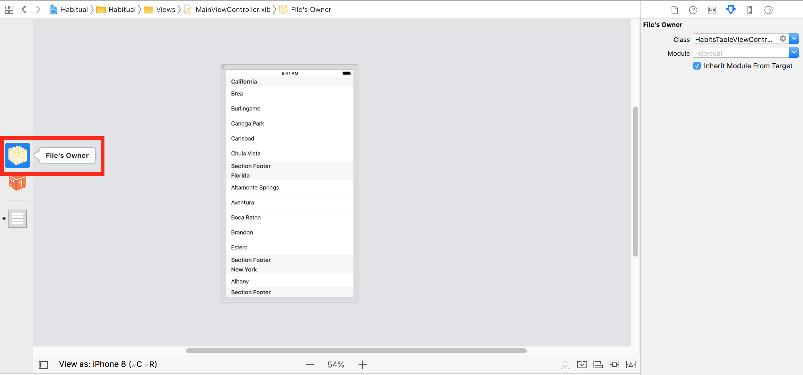

Now it's time to setup our `UITableView`.

# Using a UITableViewController

Using a `UITableViewController` will give us some helpful functionality when our screen needs to display a `UITableView`. So, we'll have to change a few things to do this:

> [action]
> In the **MainViewController.swift**, change the superclass of the `MainViewController` from `UIViewController` to `UITableViewController`.
>
```swift
class MainViewController: UITableViewController {
>
}
```

Then, rename the `MainViewController` to say `HabitsTableViewController`:

> [action]
> Rename the `MainViewController` class in the **MainViewController.swift** file (also rename the swift file) to **HabitsTableViewController.swift**.
> In the **AppDelegate.swift**, update the `MainViewController.instantiate()` to `HabitsTableViewController.instantiate()`
> Rename the xib file to be **HabitsTableViewController.xib**. Open that xib file and select the File's Owner object on the left. Then, open the **Attributes Inspector** and update the class to be `HabitsTableViewController`.
>
> 

The difference between a `UIViewController` and a `UITableViewController` is the `UITableViewController` uses a `UITableView` as its **view**. Whereas a `UIViewController` uses a blank `UIView`.

Thus, we'll have to replace the view from a `UIView` to a `UITableView`:

> [action]
> From the **Object Library**, drag out a new `UITableView` onto the canvas next to the `UIView` we already have there. Do not add the `UITableView` **inside** the `UIView`.
>
> Then, delete the `UIView`.
>
> Select the **File's Owner** and open the **Connections Inspector**. Look for the **view** connection and connect it with the `UITableView`.

We're not quite done here. We'll need to connect some properties of the `UITableView` to the `HabitsTableViewController`. Can you guess what **two properties** we need to assign to the `HabitsTableViewController`? (Hint: select the `UITableView` and look in the **Connections Inspector**).

> [solution]
> Select the `UITableView` and open the **Connections Inspector** and connect both the **dataSource** and **delegate** with the `HabitsTableViewController` which is in our case the **File's Owner**.

Run the project and you should see a blank table view.

Great! This tells the `UITableView` that its dataSource and delegate is the `HabitsTableViewController`. Now, let's customize the dataSource in the `HabitsTableViewController`.
