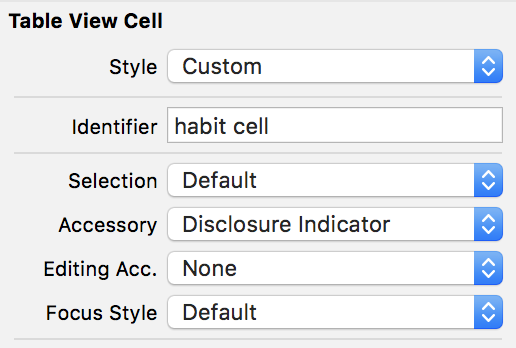
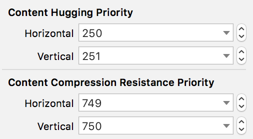

# Creating a custom cell

For the table we just created we'll be using a custom cell. Sometimes it's easier to use the default cell if the content is simple. For this app we need more than a label in the cell's content. It should look like this:


> [action]
> Create a new file. File -> New -> File -> Cocoa Touch Class -> Next
>
> Name it `HabitTableViewCell` and make it a subclass of UITableViewCell. Select the option "Also create XIB file". Then click Next.

This will create two new files. One will be the XIB file, where we'll arrange all the UI elements. And the other one is the corresponding Swift file to manage the cell and make further customizations.

> [action]
> Go to the XIB file and make sure the cell is selected to set some properties in the Attributes Inspector.
>
> First add an identifier "habit cell" for cell reuse.
>
>Next select an Accessory, choose the option "Disclosure indicator", this is the arrow that you see in the right side of the cell. Later we'll add the logic to change the accessory for a Checkmark when the habit is completed.

This is how the properties should look.



# Cell's content

Now let's go back to the cell's design. In the XIB file, place a UIImageView, and two `UILabel`s. By now you already know how to add constraints to them. A good idea is to group them in a UIStackView. Take into consideration that we have two labels in the same line. If there is a habit with a really long name, we want that content to be shown incomplete while keeping the streak count visible. Make the changes in CHP & CCRP to make this possible.

For the title label, the values for this `UILabel` should be something like this.



# Connecting the UI

Add the corresponding outlets to the HabitTableViewCell.swift file and make sure to connect them with the elements in the XIB file.

```
  @IBOutlet weak var imageViewIcon: UIImageView!
  @IBOutlet weak var labelHabitTitle: UILabel!
  @IBOutlet weak var labelStreaks: UILabel!
```

# Registering the cell

We need a way to tell the `UITableView` to use our new cell instead of the default cell. To do that we register the XIB file in the view controller that has the `UITableView`.

First, add the following code to `HabitTableViewCell`

```
// Set the identifier for the custom cell
static let identifier = "habit cell"

// Returning the xib file after instantiating it
static var nib: UINib {
       return UINib(nibName: String(describing: self), bundle: nil)
}
```

Then, open `HabitsTableViewController.swift` to finish registering the cell.
Add the following line of code inside the `viewDidLoad()` method.

```
tableView.register(
            HabitTableViewCell.nib,
            forCellReuseIdentifier: HabitTableViewCell.identifier
)
```

# Using the custom cell

We are done registering the cell and now it's time to use it in the `UITableView`'s delegate method that creates cells.

Find the `cellForRowAt` method and change its content with the following:

```
override func tableView(_ tableView: UITableView, cellForRowAt indexPath: IndexPath) -> UITableViewCell {
        let cell = tableView.dequeueReusableCell(
            withIdentifier: HabitTableViewCell.identifier,
            for: indexPath
        ) as! HabitTableViewCell

        return cell
}
```

Here we are creating cells of type `HabitTableViewCell` and reusing them with our identifier.

# Setting the content

Right now our cells are empty. We need to give them a habit to populate their UI elements.

Include these lines before returning the cell.

```
let habit = habits[indexPath.row]
cell.configure(habit)
```

Your tableView(tableView:cellForRowAt:) should look like this:
```swift
    override func tableView(_ tableView: UITableView, cellForRowAt indexPath: IndexPath) -> UITableViewCell {
        let cell = tableView.dequeueReusableCell(
            withIdentifier: HabitTableViewCell.identifier,
            for: indexPath
            ) as! HabitTableViewCell
>
        let habit = persistance.habits[indexPath.row]
        cell.configure(habit)
>
        return cell
    }
```

Here we take a habit from the array that corresponds to the index of the cell. Then we call a method call configure in the cell and send the habit. This method doesn't exist yet. Let's go back to `HabitTableViewCell` and create it.

```
func configure(_ habit: Habit) {
  self.imageViewIcon.image = habit.selectedImage.image
  self.labelHabitTitle.text = habit.title
  self.labelStreaks.text = "streak: \(habit.currentStreak)"

  if habit.hasCompletedForToday {
    self.accessoryType = .checkmark
  } else {
   self.accessoryType = .disclosureIndicator
  }
}
```

This method sets the contents of the `UIImageView`, the `UILabel`s and evaluates if the cell should show the checkmark or the arrow depending if the habit is completed.
