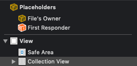
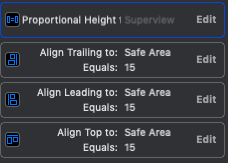
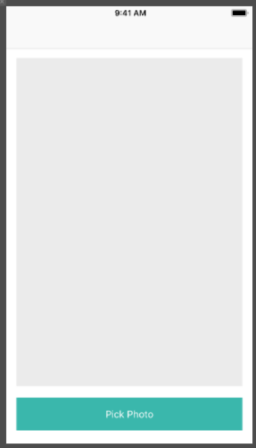
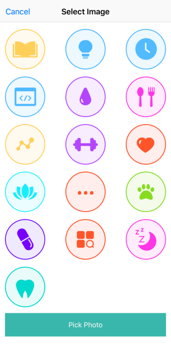

Our app so far looks to have many of the barebones components that we need to at least show our habits. However, how can we show off our habits without creating them first? Let's do that now!

# Outline

First, when we are going through the process of creating the habit, we will select an image that represents the habit.

To do this, we will setup a new view controller that will have a collection view and each cell will be an image with some icon representing a habit.

Next, we will allow our users to select an image from the collection view. This image will be highlighted.

Lastly, once the user is done with selecting their image, we will have a button that will allow them to pick a photo and to transition to the confirmation screen.

## Creating the New ViewController

> [action]
> Create a new `UIViewController` with the *XIB file choice* selected,
> name it *AddHabitViewController*

This will be the view controller that will have our collection view, now let us add that.

>[action]
> In our interface objects library, search for a `CollectionView` and drag and drop it into your new view controller.

Collection Views might be a new concept to you, but not to worry, you have seen something similiar before. You can think of a collection view as a more flexible way to group a "collection" of items, just like a table view, but there is even more flexibility with collection views. Just like a table view, they have to know which view controller will be its delegate and its datasource.

>[action]
> Before we forget, lets control drag from our collection view to the icon that says *file's Owner' and select just the boxes that say *datasource* and *delegate*

> 

Now our collection view knows what is responsible for handling the datasource and the delegate, in this case it will be the `AddHabitViewController`.

To finish off the actual layout on this view controller, let us add a button at the bottom that will be pressed once the user picks an image for their habit.

>[action]
> In our interface objects library search for a `Button` and drag and drop it to the bottom of our view controller and change its text to *Pick Photo*

Unfortunately, we have this new view controller, but no way to get to this view controller from our `HabitsTableViewController`, lets go back into our `HabitsTableViewController` and instead of the adding a new habit in the add button, we are going to add the code that will allow us to navigate to our new `AddHabitViewController`:

> [action]
> In the `pressAddHabit()` function, create an instance of our new `AddHabitViewController` and also create a `UINavigationController` and put our new `AddHabitViewController` imbedded into our `UINavigationController` and then *present* the `UINavigationController`

```
    @objc func pressAddHabit(_ sender: UIBarButtonItem) {
      let addHabitVC = AddHabitViewController.instantiate()
      let navigationController = UINavigationController(rootViewController: addHabitVC)
      navigationController.modalPresentationStyle = .fullScreen
      present(navigationController, animated: true, completion: nil)
    }
```
## Constraining our CollectionView

Great, now let us constrain our new collection view and button

>[action]
> Using AutoLayout, constrain the collection view to have the following constraints(The height of the Collection View should be 0.75 proportional to the height of the superview):

> 

> Also Constrain the button to have a *height* of  *50* and *trailing and leading spaces* to be *15* and the bottom to be aligned *20* from the bottom of the super view

Our resulting `AddhabitViewController` should look like this:



## CollectionView Cells

We finally finished the initial setup of our AddHabitViewController. We can now move into some code to allow our collection view to show some content.

To show an item in our collection view, we have to layout our cell that will be displayed as a single "item" in our collection view. This cell will simply just be an ImageView.

>[action]
> Create a new Cocoa Touch Class and name it `HabitImageCollectionViewCell` and have it subclass `UICollectionViewCell` and also check the box that creates the XIB file for you and press next

>[action]
> In our new xib file, drag an *image view* from the object library and create an `IBOutlet` named *habitImage*. Move it to inside the cell and then constrain the new *image view* to be the size of the cell itself. I know this is a lot of stuff to do, but you definitely can do this! As a hint, make sure to set your image view's auto layout *constraints to 0 on all sides*.

Our new cell class is also going to need to use a reuse identifier to be set also and our imageView's content mode needs to be set to Aspect Fill :

>[action]
> Select the *collectionViewCell* and then in the *attributes inspector*, set the *identifier* to *HabitImageCell*. Then click the *imageView* and then click on the *attributes inspector* and set the *content mode* to *Aspect Fit*  

Now we are on our way to be able to write some code!

>[action]
> Open the `HabitImageCollectionViewCell` and delete the code `awakesFromNib()` as we will not be needing this. Now we will add the following code that will be enough to have our cell fully configured.

```
class HabitImageCollectionViewCell: UICollectionViewCell {
    @IBOutlet weak var habitImage: UIImageView!
    static let identifier = "habit image cell"

    static var nib: UINib {
        return UINib(nibName: String(describing: self), bundle: nil)
    }

    func setImage(image: UIImage){
        self.habitImage.image = image
    }
}
```

In this code, we are creating a static variable which allows us to access that property within our `AddHabitViewController`, and also allowing the cell's nib to be called and used for initialization in the future. The `setImage()` property sets the specific image for the cell that will be called in our datasource methods over in our `AddHabitViewController`.

Enough talk of our `AddHabitViewController`, let us add the code we need to be able to finally display our images in the collection view.

>[action]
> Head over to the `AddHabitViewController` and lets create an `@IBOutlet` for our collection view and lets name it `collectionView` and to also create an `@IBAction` for our button and we will call it `pickPhotoButtonPressed`

We need to assign the `collectionView` to register the cells that we just created with the identifier that we just set.

>[action]
> In `viewDidLoad()` add the following code
>
```
override func viewDidLoad() {
>
    super.viewDidLoad()
>
    collectionView.register(HabitImageCollectionViewCell.nib, forCellWithReuseIdentifier: HabitImageCollectionViewCell.identifier)
>
}
```
>

Awesome! Before we jump right into the collection view methods, we will need to do some final setup of our view controller:

>[action]
> Add the following:
>
```
override func viewDidLoad() {
>
...
>
  setupNavBar()    
>
}
```
>

We will have to define a setupNavBar function. Add the following code to the `setupNavBar()` function below the `viewDidLoad` method

```
    func setupNavBar() {
        title = "Select Image"

        let cancelButton = UIBarButtonItem(barButtonSystemItem: .cancel, target: self, action: #selector(cancelAddHabit(_:)))
        navigationItem.leftBarButtonItem = cancelButton

    }
```
Note the #selector which will mean that whenever our new cancel button is pressed, it will look for a function called `cancelAddHabit()`. Let us add that code right below, and don't forget to add the @obj since the #selector syntax is part of objective C , but we wont go into depth about that right now.

>[action]
> Add the `cancelAddHabit()` function below the `setupNavBar()` function:
>
```
@objc func cancelAddHabit(_ sender: UIBarButtonItem) {
>
    self.presentingViewController?.dismiss(animated: true, completion: nil)
>
}
```
>

## CollectionView Extension

To keep our code cleaner, we are going to use an `extension` that visually allows us to separate the collectionView related methods so that we can easily keep track of what is going on with our collection view, or else things would get pretty hectic.

>[action]
> create an `extension` below your `AddHabitViewController` and add the following code:
>
```
class AddHabitViewController: UIViewController{
>
    ...
>
}
>
extension AddHabitViewController: UICollectionViewDataSource, UICollectionViewDelegate, UICollectionViewDelegateFlowLayout {
>
}
```
>

Xcode should now be yelling at us that our view controller does not conform to the `UICollectionViewDataSource` protocol. We can change this by clicking on the red box and clicking `fix` on the error message and it will give us our code stubs, or just add this code:

```
extension AddHabitViewController: UICollectionViewDataSource, UICollectionViewDelegate, UICollectionViewDelegateFlowLayout {
    func collectionView(_ collectionView: UICollectionView, numberOfItemsInSection section: Int) -> Int {

    }

    func collectionView(_ collectionView: UICollectionView, cellForItemAt indexPath: IndexPath) -> UICollectionViewCell {

    }
}
```

We may be encountering more errors with our other missing protocols, but let us ignore that for now. We have a `collectionView(..numberOfItemsInSecion)` function that is telling us that we need to give the collection view the number of items it should be expecting per section. We will have one section that will display 3 columns and as many rows as we may need depending on the amount of images that are provided. Although we have one section, we want our `collectionView(..numberOfItemsInSecion)` to be as many items as the elements that will be provided to us. Our resulting collection view will look like this:

> 


The `collectionView(..cellForItemAt)` is an important function that will tell the collection view which item to display at the index path, this will make it really easy to use an array and use `indexpath.row` as an index. Do you have any ideas of what array could be the source of the data we need?

What about the `Images` property that belongs to our Habit model that we created earlier? We can use all the images that we are storing with our models that are getting pulled from our assets and use them to set the image in our cell that we created earlier. Let us create the array at the top of our `AddHabitViewController`.

```
class AddHabitViewController: UIViewController {
    let habitImages = Habit.Images.allCases

    ...
}
```

We can also add to our collection view functions to reflect some of the ideas that we just discussed.

>[action]
> Set the number of items in `collectionView(..numberOfItemsInSection)` to be the length of our `habitImages` array and within the `collectionView(..cellForItemAt)`create a reusable cell and set the cell's image to be at the `indexPath.row` element in our `habitImages` array:
>
```
...
>
func collectionView(_ collectionView: UICollectionView, numberOfItemsInSection section: Int) -> Int {
>
    return habitImages.count
>
}
>
func collectionView(_ collectionView: UICollectionView, cellForItemAt indexPath: IndexPath) -> UICollectionViewCell {
>   
    let cell = collectionView.dequeueReusableCell(withReuseIdentifier: HabitImageCollectionViewCell.identifier, for: indexPath) as! HabitImageCollectionViewCell
>
     cell.setImage(image: habitImages[indexPath.row].image)
>
     return cell
>
}
...
```
>

It's coming along now! Our collection view knows exactly which element should populate the cell and it will also know how many elements it will need to have as well as the number of sections it needs.

## Cell Formatting
Our content is all finished for our collection view, but now we need to do some formatting using our `UICollectionViewDelegateFlowLayout`.

>[action]
> In the extension, add the `collectionView(..minimumLineSpacingForSectionAt:)` and the `collectionView(..sizeForItemAt:)` code to set the minimum spacing to *10* and the *width* and the *height* to be 1/4 the size of the collection view's width. The last part will add a little padding to our collection view in the left and right edges.

 ```
     func collectionView(_ collectionView: UICollectionView, layout collectionViewLayout: UICollectionViewLayout, minimumLineSpacingForSectionAt section: Int) -> CGFloat {
        return 10.0
    }

    func collectionView(_ collectionView: UICollectionView, layout collectionViewLayout: UICollectionViewLayout, sizeForItemAt indexPath: IndexPath) -> CGSize {
        let collectionViewWidth = collectionView.bounds.width
        return CGSize(width: collectionViewWidth/4, height: collectionViewWidth/4)
    }

    func collectionView(_ collectionView: UICollectionView,
                        layout collectionViewLayout: UICollectionViewLayout,
                        insetForSectionAt section: Int) -> UIEdgeInsets {
        return UIEdgeInsets(top: 0, left: 10, bottom: 0, right: 10)
    }
```

In this code, we are setting the height and width in proportion to just the width of the collection view since we both want a square sized item and to also have three columns with the spacing included. Now would be a good time to run the app to see if you have everything correct so far. You should see the collection view populated and look like this:


# Selecting the images

The sole point of this screen is to be able to *select* an image for our new habit, but we can't do that yet. We can do this with an animation, taking advantage of prebuilt method from UICollectionView.

>[action]
>Add the following at the top of **AddHabitViewController**
>
```
var selectedIndexPath: IndexPath? {
    didSet {
        var indexPaths: [IndexPath] = []
        if let selectedIndexPath = selectedIndexPath {
            indexPaths.append(selectedIndexPath)
        }
        if let oldValue = oldValue {
            indexPaths.append(oldValue)
        }
        collectionView.performBatchUpdates({
            self.collectionView.reloadItems(at: indexPaths)
        })
    }
}
```
>

We created a property to track what indexPath we have selected. It has an observer to detect when that value changes. When we select a new indexPath, we get to the first if statement. If we selected the same item twice, we get to the second if statement. Then we call the method `performBatchUpdates` that will take care of reloading the corresponding items in the collection view. Now let's see where `selectedIndexPath` must change.

>[action]
> Add the following method in the extension.
>
```
func collectionView(_ collectionView: UICollectionView, shouldSelectItemAt indexPath: IndexPath) -> Bool {
    if selectedIndexPath == indexPath {
      selectedIndexPath = nil
    } else {
      selectedIndexPath = indexPath
    }
      return false
}
```
>

Here we are changing the value of our property right when the collection view detects we want to select an item (just before it actually gets selected). Let's have a visible difference between selected and non selected cells.

> [action]
> Update your method in the extension to match the following:
```
func collectionView(_ collectionView: UICollectionView, cellForItemAt indexPath: IndexPath) -> UICollectionViewCell {
    let cell = collectionView.dequeueReusableCell(withReuseIdentifier: HabitImageCollectionViewCell.identifier, for: indexPath) as! HabitImageCollectionViewCell
    if indexPath == selectedIndexPath{
        cell.setImage(image: habitImages[indexPath.row].image, withSelection: true)
    }else{
        cell.setImage(image: habitImages[indexPath.row].image, withSelection: false)
    }
    return cell
}
```
>

We are sending over a boolean value when creating the cell to specify if it should be drawn differently if selected or not. Let's make the actual difference happen in the cell's class.

> [action]
> Update your method in HabitImageCollectionViewCell to match the following:
```
func setImage(image: UIImage, withSelection: Bool){
    if withSelection {
      self.habitImage.image = image.withRenderingMode(.alwaysOriginal)
    }else{
      self.habitImage.image = image.withRenderingMode(.alwaysTemplate)
      self.habitImage.tintColor = UIColor.gray
    }
}
```
>

We can change the tint color of images in a UIImageView if we set the image to be used as a template. That's what we do here if the item is not selected, we change the color to gray. When the item is indeed selected we want to show the image's original color.

# Summary
In this section, you learned how to create a collection view and also how to create a custom collection view cell that updates with animations. You also practiced your Auto Layout skills to constrain the layouts that we created, and then followed readability practices with `extensions` to make our code more readable. You also learned how to implement the datasource, delegate and layout protocols for collection views and this allowed us to be able to display all the images of possible habits that we wanted. We made so much progress on this page! Take a break, you deserve it, and come back ready for part two of adding the habits.
