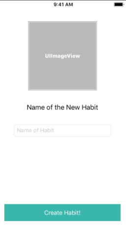
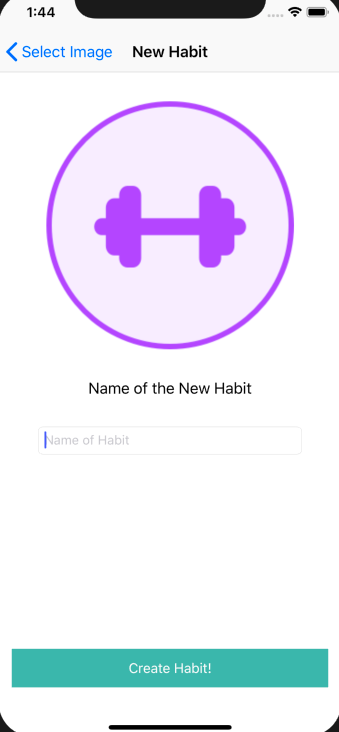

# Overview

Remember that in our last page, we create the collection view that showed possible images for our new habit.

From there, a user could select an image of their choosing, but now we need to communicate which image was selected to another view controller so that we can give the new habit a name.

## Creating a New ViewController

>[action]
> Create a new `UIViewController` and name it `ConfirmHabitViewController`, make sure to select the XIB option

We'll need a few things:

1. Add UI elements and constrain them to look like the layout below.
2. Also create *Outlets* for the image view and name it  `habitImageView`.  
3. We'll need an outlet for the *textField* and name it  `habitNameInputField`.
4. Make sure you also create an `IBAction` for the button and name it `createHabitButtonPressed`. We will use this to create our new Habit.

I will let you decide how you should constrain the view, but a hint would be to use some stack views.

> 

>[action]
> We need to create an `Habit.Image` variable that will be set by the `AddHabitViewController` but will live as a variable in the `ConfirmHabitViewController`
```
class ConfirmHabitViewController: UIViewController {
    ...
    var habitImage: Habit.Images!
}
```

Now that we have the UI done, we need to be able to navigate to our new `ConfirmHabitViewController` from the `AddHabitViewController`. We also need to tell our *UIImageView* that the image we want to show in the `ConfirmHabitViewController` is going to be the image that the user selected. Can you think of ways we can communicate the information? Give it a try and refer to the code below if you get stuck:

>[action]
> In `AddHabitViewController` navigate to `ConfirmHabitViewController` in the `pickPhotoButtonPressed()` function and set the *imageView* to the image that was selected:

```
    @IBAction func pickPhotoButtonPressed(_ sender: Any) {
        guard let selectedIndexPath = selectedIndexPath else {return}
        let confirmHabitVC = ConfirmHabitViewController.instantiate()
        confirmHabitVC.habitImage = habitImages[selectedIndexPath.row]
        navigationController?.pushViewController(confirmHabitVC, animated: true)
    }
```

We want our `ConfirmHabitViewController` to be updated with the new image every time the view appears, so it would be smart to create an `updateUI()` and call it in a `viewWillAppear`, note that we aren't doing this in `viewDidLoad()`. You can delete `viewDidLoad()` since we will not need it for this case.

>[action]
> Create a private `updateUI()` function, the `private` means that we can only access the function within the `ConfirmHabitViewController`.

```
...
    override func viewWillAppear(_ animated: Bool) {
        super.viewWillAppear(animated)

        updateUI()
    }

    private func updateUI() {
        title = "New Habit"
        habitImageView.image = habitImage.image
    }
...
```

## Final Steps

Now we just have to handle the logic to create a habit once the user presses the create habit button.

How would you handle this logic? If you know exactly how you are going to handle this, then try it out.

>[solution]
> Write the logic within the `createHabitButtonPressed()` function to create a new habit and then dismiss the current `UINavigationViewController`. As a *Stretch Challenge* try and do some validation to check if the text field is empty so that somebody doesn't have a habit with no name.
>
```
>
    @IBAction func createHabitButtonPressed(_ sender: Any) {
        var persistenceLayer = PersistenceLayer()
        guard let habitText = habitNameInputField.text else { return }
        persistenceLayer.createNewHabit(name: habitText, image: habitImage)
        self.presentingViewController?.dismiss(animated: true, completion: nil)
    }
```
>

Awesome! Now when you run the app, you should be able to create a habit and have it show up in the `HabitsTableViewController`. Your `ConfirmHabitViewController` should look like this in the simulator:

> 


 You almost have a fully functional app! Great job, you have done great so far.

# Summary

In this section, we applied most of our previous knowledge such as creating an `UIViewController` and we also allowed for communication between view controllers by creating a reference to a `ConfirmHabitViewController` and calling its habitImage variable to set that image based off of what the user selected. We also put our persistence layer to good use by abstracting away the logic of creating a habit and saving that habit. This technique follows our single responsibility technique as our view controller itself is not responsible for actually creating the `Habit()` object. Onwards to the next section!
