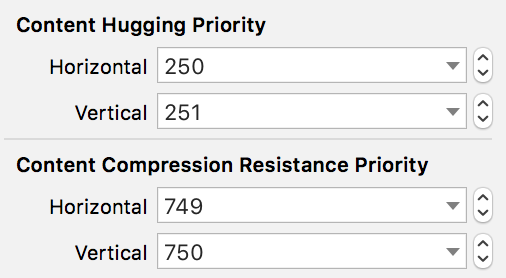

Now that we are able to persist a user's habits, we should give them a way to be able to see a detailed view of their habits.

</img>

In the screen recording above,this serves as an example of what the finished detail view will look like!

Shall we start?

Firstly, lets create a .xib and a corresponding .swift file for our Detailed View Controller!

**New => File => Cocoa Touch Class => "Name it Detailed View Controller" => Include Xib File**

Let's model the xib as seen in the giphy recording up above. You should be familiar with placing elements in a UIStackView.Take into consideration that we have two labels in the same line. If there is a habit with a really long name, we want that content to be shown incomplete while keeping the streak count visible. Make the changes in CHP & CCRP to make this possible.

</img>

Now that we have our design implemented, lets connect our design elments to the corresponding .swift file!

```
import UIKit

class HabitDetailedViewController: UIViewController {
    
    // MARK: - VARS
    
    var habit: Habit!
    var habitIndex: Int!
    
    private var persistance = PersistenceLayer()
    
    // MARK: - IBACTIONS and IBOUTLETS
    
    @IBOutlet weak var imageViewIcon: UIImageView!
    @IBOutlet weak var labelCurrentStreak: UILabel!
    @IBOutlet weak var labelTotalCompletions: UILabel!
    @IBOutlet weak var labelBestStreak: UILabel!
    @IBOutlet weak var labelStartingDate: UILabel!
    @IBOutlet weak var buttonAction: UIButton!
    
    // MARK: - LIFE CYCLE
    
    override func viewWillAppear(_ animated: Bool) {
        super.viewWillAppear(animated)
           
        }
}

```

As you can see we insantiated a variable habit and habit index, this will come in handy when we have to perform some logic on the given habit ... may be sooner than you think!

You'll notice that we are **missing** a UIElement, one that hasn't been connected to our code yet.

Let's add this code snippet to where we instnatiate our IBActions and IB Outlets!

```
@IBAction func pressActionButton(_ sender: Any) {
        // Line 1
        habit = persistance.markHabitAsCompleted(habitIndex)

        // Line 2
        updateUI()
    }
```

* If you refer back to our persistence layer tutorial page you'll remember making a markHabitAsCompleted method. When a user presses the complete button we want to have the added logic of marking that habit as completed in our persistence layer!

*There goes that habitIndex we were talking about earlier! Take a guess as to why we pass in the habit index?*

* As developers, we adopt a top down approach with what the user is interacting with down to its implementation. We have called an updateUI method that does not exist yet ... let's take a look!

```
  private func updateUI() {
        // Line 1
        title = habit.title
        imageViewIcon.image = habit.selectedImage.image
        labelCurrentStreak.text = "\(habit.currentStreak) days"
        labelTotalCompletions.text = String(habit.numberOfCompletions)
        labelBestStreak.text = String(habit.bestStreak)
        labelStartingDate.text = habit.dateCreated.stringValue
        
        // Line 2
        if habit.hasCompletedForToday {
            buttonAction.setTitle("Completed for Today!", for: .normal)
        } else {
            buttonAction.setTitle("Mark as Completed", for: .normal)
        }
    }
```

Lets attack this from a logical standpoint, the user is interacting with this complete button, subsequently calling the updateUI method.

* Group 1 is in charge of updating the UIElements on screen to accurately reflect the changes made to the habit! As you can see we are changing the text values to match the habits current updated values

* Group 2 is in charge of charge of checking if that habit has been completed today, what would make this logic break?


