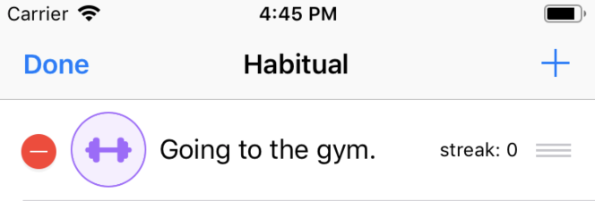
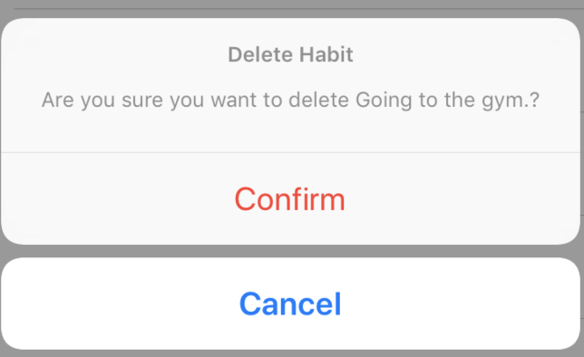

# Deleting Habits

Our Habitual app is now able to track new habits. But we also want to be able to delete habits, in case we decide we no longer want to track certain things.

To do that let's add an **Edit** button in the left side of the navigation bar.

This is what we want to achieve. Hopefully going to the gym is not the habit you want to delete when using the app for real purposes.



Go to the method `setupNavBar()` in the `HabitsTableViewController` extension and add the following line of code.

```        
navigationItem.leftBarButtonItem = self.editButtonItem

```

Now let's include the method from the `UITableView` delegate that will let us delete entries.

```
override func tableView(_ tableView: UITableView, commit editingStyle: UITableViewCellEditingStyle, forRowAt indexPath: IndexPath) {
  switch editingStyle {
    case .delete:

      // handling the delete action

   default:
      break
   }
}
```

This method receives an `editingStyle` parameter. We first check if it corresponds to the delete option with a switch statement. If it matches, then we get hold of the habit from the array with the selected index and save the index we want to delete in another constant.

```
let habitToDelete = persistance.habits[indexPath.row]
let habitIndexToDelete = indexPath.row
```

Then we show the user an alert to ask for confirmation. When asking the user for actions such as editing or deleting elements it is always good practice to ask for a confirmation. This will help avoid doing something they didn't intend to do.




Once the user confirms the action, the `UIAlertController` executes 2 things: deleting the habit entry from our saved entries and delete the cell at the indexPath we saved before.

```

let deleteAlert = UIAlertController(habitTitle: habitToDelete.title) {
self.persistance.delete(habitIndexToDelete)
tableView.deleteRows(at: [indexPath], with: .automatic)
}

self.present(deleteAlert, animated: true)

```

The final implementation of the method should look like this.

```
override func tableView(_ tableView: UITableView, commit editingStyle: UITableViewCellEditingStyle, forRowAt indexPath: IndexPath) {
  switch editingStyle {
    case .delete:
      let habitToDelete = persistance.habits[indexPath.row]
      let habitIndexToDelete = indexPath.row

      let deleteAlert = UIAlertController(habitTitle: habitToDelete.title) {
        self.persistance.delete(habitIndexToDelete)
        tableView.deleteRows(at: [indexPath], with: .automatic)
      }

      self.present(deleteAlert, animated: true)
    default:
      break
    }
}
```

# Changing the order of habits

Let's say we like to order the habits in a way that the first to be completed during the day goes in the top, and the last habit to be completed during the day is the last in the list.
When adding new habits we need to arrange them where they fit best.

We can use the `UITableView`'s ability to reorder cells for this task.

Let's add this method.

```
override func tableView(_ tableView: UITableView, moveRowAt sourceIndexPath: IndexPath, to destinationIndexPath: IndexPath) {
  persistance.swapHabits(habitIndex: sourceIndexPath.row, destinationIndex: destinationIndexPath.row)
}
```

This method will move the cell and call the method `swapHabits` in our persistence layer. Let's go there and write the method.

The method will receive the index of the habit we want to move and the new index it will have in the list.

```
mutating func swapHabits(habitIndex: Int, destinationIndex: Int) {
  let habitToSwap = self.habits[habitIndex]
  self.habits.remove(at: habitIndex)
  self.habits.insert(habitToSwap, at: destinationIndex)
  self.saveHabits()
}
```

Then it makes a copy of the habit. Removes the entry at the old index, and adds the copy in the destination index. After that, the habits need to be saved to keep the changes.

# The end

We did it! We completed our habits app. Along the way we learned:

- Using XIB files
- Setting Constraints
- Creating custom cells
- Use table views and collection views
- Creating a persistence layer with NSUserDefaults
- Structuring code in MVC
- Navigating between screens

# Stretch challenges

There is a lot more you can do to make this app even better and to keep practicing iOS development. Here are a few stretch challenges:

- Make it look good! Our first implementation was focused on getting it to work. Play with colors, fonts and sizes to make it look better.
- Add a validation when selecting an icon and entering a title. Tell the user if they are missing something and think about what's the beast way to do this. Is it a hidden label? and alert?
- Rearrange habits using tap and hold instead of the edit button.
- Implement Search bar in the habit table.
